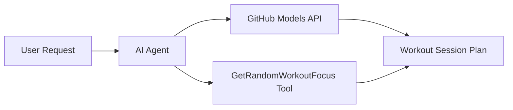

# 💪 AI Workout Planner Agent with Microsoft Agent Framework (.NET)

## 📋 Scenario Overview

This example demonstrates how to build an intelligent personal trainer agent using the Microsoft Agent Framework for .NET. The agent can automatically generate structured workout sessions tailored to a randomly selected focus area.

### Key Capabilities:

- 🎲 **Random Focus Area Selection**: Uses a custom tool to pick a muscle group or training style
- 🏋️ **Intelligent Session Planning**: Creates structured workouts with warm-up, exercises, and cool-down
- 🔄 **Real-time Streaming**: Supports both immediate and streaming responses
- 🛠️ **Custom Tool Integration**: Demonstrates how to extend agent capabilities

## 🔧 Technical Architecture

### Core Technologies

- **Microsoft Agent Framework**: Latest .NET implementation for AI agent development
- **GitHub Models Integration**: Uses GitHub's AI model inference service
- **OpenAI API Compatibility**: Leverages OpenAI client libraries with custom endpoints
- **Secure Configuration**: Environment-based API key management

### Key Components

1. **AIAgent**: The main agent orchestrator that handles conversation flow
2. **Custom Tools**: `GetRandomWorkoutFocus()` function available to the agent
3. **Chat Client**: GitHub Models-backed conversation interface
4. **Streaming Support**: Real-time response generation capabilities

### Integration Pattern



## 🚀 Getting Started

### Prerequisites

- [.NET 10 SDK](https://dotnet.microsoft.com/download/dotnet/10.0) or higher
- [GitHub Models API access token](https://docs.github.com/github-models/github-models-at-scale/using-your-own-api-keys-in-github-models)

### Required Environment Variables

```bash
# zsh/bash
export GH_TOKEN=<your_github_token>
export GH_ENDPOINT=https://models.github.ai/inference
export GH_MODEL_ID=openai/gpt-5-mini
```

```powershell
# PowerShell
$env:GH_TOKEN = "<your_github_token>"
$env:GH_ENDPOINT = "https://models.github.ai/inference"
$env:GH_MODEL_ID = "openai/gpt-5-mini"
```

### Sample Code

To run the code example:

```bash
# zsh/bash
chmod +x ./01-dotnet-agent-framework.cs
./01-dotnet-agent-framework.cs
```

Or using the dotnet CLI:

```bash
dotnet run ./01-dotnet-agent-framework.cs
```

See [`01-dotnet-agent-framework.cs`](./01-dotnet-agent-framework.cs) for the complete code.

```csharp
#!/usr/bin/dotnet run
#:package Microsoft.Extensions.AI@10.4.1
#:package Microsoft.Extensions.AI.OpenAI@10.4.1
#:package Microsoft.Agents.AI.OpenAI@1.1.0
using System.ClientModel;
using System.ComponentModel;
using Microsoft.Agents.AI;
using Microsoft.Extensions.AI;
using OpenAI;

// Tool Function: Random Focus Area Generator
// Returns a random muscle group or training style for the agent to build a session around
[Description("Provides a random workout focus area, such as a muscle group or training style.")]
static string GetRandomWorkoutFocus()
{
    var focusAreas = new List<string>
    {
        "Chest & Triceps",
        "Back & Biceps",
        "Legs & Glutes",
        "Shoulders & Core",
        "Full Body HIIT",
        "Upper Body Strength",
        "Lower Body Endurance",
        "Core & Mobility",
        "Push Day",
        "Pull Day"
    };

    var random = new Random();
    int index = random.Next(focusAreas.Count);
    return focusAreas[index];
}

// Extract configuration from environment variables
var github_endpoint = Environment.GetEnvironmentVariable("GH_ENDPOINT") ?? "https://models.github.ai/inference";
var github_model_id = Environment.GetEnvironmentVariable("GH_MODEL_ID") ?? "openai/gpt-5-mini";
var github_token = Environment.GetEnvironmentVariable("GH_TOKEN") ?? throw new InvalidOperationException("GH_TOKEN is not set.");

// Configure OpenAI client to point at GitHub Models
var openAIOptions = new OpenAIClientOptions()
{
    Endpoint = new Uri(github_endpoint)
};

var openAIClient = new OpenAIClient(new ApiKeyCredential(github_token), openAIOptions);

// Create AI Agent with Personal Trainer Capabilities
// The agent uses GetRandomWorkoutFocus to determine today's training focus,
// then builds a full session plan around it
AIAgent agent = openAIClient
    .GetChatClient(github_model_id)
    .AsAIAgent(
        instructions: "You are an enthusiastic personal trainer AI that designs structured workout sessions. " +
                      "When asked to plan a workout, use your tool to pick a focus area, then provide a warm-up, " +
                      "4-6 exercises with sets/reps/rest times, and a cool-down. Keep it practical and motivating.",
        tools: [AIFunctionFactory.Create(GetRandomWorkoutFocus)]
    );

// Run the agent with streaming so the session plan appears in real time
await foreach (var update in agent.RunStreamingAsync("Plan me a workout session for today"))
{
    await Task.Delay(10);
    Console.Write(update);
}
```

## 🎓 Key Takeaways

1. **Agent Architecture**: The Microsoft Agent Framework provides a clean, type-safe approach to building AI agents in .NET
2. **Tool Integration**: Functions decorated with `[Description]` attributes become available tools for the agent
3. **Configuration Management**: Environment variables and secure credential handling follow .NET best practices
4. **OpenAI Compatibility**: GitHub Models integration works seamlessly through OpenAI-compatible APIs

## 🔗 Additional Resources

- [Microsoft Agent Framework Documentation](https://learn.microsoft.com/agent-framework)
- [GitHub Models Marketplace](https://github.com/marketplace?type=models)
- [Microsoft.Extensions.AI](https://learn.microsoft.com/dotnet/ai/microsoft-extensions-ai)
- [.NET Single File Apps](https://devblogs.microsoft.com/dotnet/announcing-dotnet-run-app)
